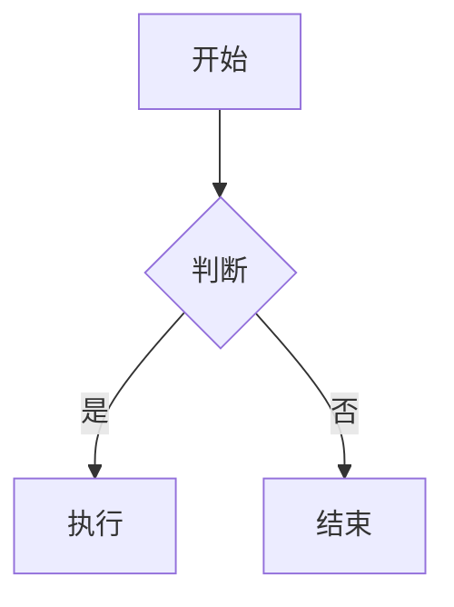

# Markdown 语法速查词典 - 扩展篇

> 目标：覆盖表格、脚注、高亮、Mermaid 和其他常见扩展。

## 表格

渲染效果：

| 左对齐 | 居中 | 右对齐 |
| :--- | :---: | ---: |
| A | B | C |
| D | E | F |

源码：

```markdown
| 左对齐 | 居中 | 右对齐 |
| :--- | :---: | ---: |
| A | B | C |
| D | E | F |
```

说明：

- `:` 在左边表示左对齐。
- `:` 在两边表示居中。
- `:` 在右边表示右对齐。

## 脚注

部分渲染器支持脚注。

渲染效果：

这是一条脚注引用[^1]。

[^1]: 这里是脚注内容。

源码：

```markdown
这是一条脚注引用[^1]。

[^1]: 这里是脚注内容。
```

## 高亮与标记

部分渲染器支持高亮。

渲染效果：

==高亮文本==

<mark>高亮文本</mark>

源码：

```markdown
==高亮文本==
```

```markdown
<mark>高亮文本</mark>
```

## Mermaid 与图表

一些平台支持 Mermaid 图表。

渲染效果：



源码：

```markdown

```

## 数学公式

部分渲染器支持数学公式。

渲染效果：

$E = mc^2$

$$
\sum_{i=1}^{n} i = \frac{n(n+1)}{2}
$$

源码：

```markdown
$E = mc^2$

$$
\sum_{i=1}^{n} i = \frac{n(n+1)}{2}
$$
```

## 纯文本速记

```text
表格：| a | b |
脚注：[^1]
高亮：==text== / <mark>text</mark>
Mermaid：```mermaid ... ```
数学公式：$...$ / $$...$$
```

