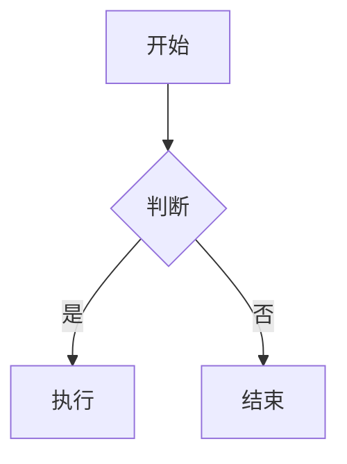

# Markdown 语法速查词典

> 目标：把常用 Markdown 语法一次性放在同一页，方便直接复制。
>
> 说明：下面示例以常见 Markdown / GitHub Flavored Markdown (GFM) 为主，不同渲染器可能对少数扩展语法支持不同。
>
> 拆分版入口：[`Markdown语法速查词典-总索引.md`](Markdown语法速查词典-总索引.md)

## 目录

- [标题](#标题)
- [段落与换行](#段落与换行)
- [强调](#强调)
- [引用](#引用)
- [列表](#列表)
- [任务列表](#任务列表)
- [代码](#代码)
- [链接](#链接)
- [图片](#图片)
- [表格](#表格)
- [分割线](#分割线)
- [转义](#转义)
- [行内 HTML](#行内-html)
- [脚注](#脚注)
- [删除线](#删除线)
- [高亮与标记](#高亮与标记)
- [锚点与目录](#锚点与目录)
- [Mermaid 与扩展](#mermaid-与扩展)

## 标题

渲染效果：

# 一级标题
## 二级标题
### 三级标题
#### 四级标题
##### 五级标题
###### 六级标题

源码：

```markdown
# 一级标题
## 二级标题
### 三级标题
#### 四级标题
##### 五级标题
###### 六级标题
```

## 段落与换行

渲染效果：

这是第一段。

这是第二段。

这是同一段里的换行。  
下一行。

源码：

```markdown
这是第一段。

这是第二段。

这是同一段里的换行。  
下一行。
```

说明：

- 段落之间空一行。
- 行尾加两个空格可以强制换行。

## 强调

渲染效果：

*斜体*

**粗体**

***粗斜体***

源码：

```markdown
*斜体*
_斜体_

**粗体**
__粗体__

***粗斜体***
___粗斜体___
```

## 引用

渲染效果：

> 一级引用
>
> > 二级引用

源码：

```markdown
> 一级引用
>
> > 二级引用
```

## 列表

无序列表：

渲染效果：

- 项目 A
- 项目 B
  - 子项 B1
  - 子项 B2
* 项目 C
+ 项目 D

源码：

```markdown
- 项目 A
- 项目 B
  - 子项 B1
  - 子项 B2
* 项目 C
+ 项目 D
```

有序列表：

渲染效果：

1. 第一项
2. 第二项
   1. 子项 2.1
   2. 子项 2.2
3. 第三项

源码：

```markdown
1. 第一项
2. 第二项
   1. 子项 2.1
   2. 子项 2.2
3. 第三项
```

定义列表：部分渲染器支持。

渲染效果：

术语
: 术语解释

另一个术语
: 另一个解释

源码：

```markdown
术语
: 术语解释

另一个术语
: 另一个解释
```

## 任务列表

渲染效果：

- [x] 已完成
- [ ] 未完成
- [ ] 仍待处理

源码：

```markdown
- [x] 已完成
- [ ] 未完成
- [ ] 仍待处理
```

## 代码

行内代码：

渲染效果：

使用 `printf()` 输出。

源码：

```markdown
使用 `printf()` 输出。
```

代码块：

渲染效果：

```c
#include <stdio.h>

int main(void) {
    printf("Hello, Markdown!\n");
    return 0;
}
```

源码：

````markdown
```c
#include <stdio.h>

int main(void) {
    printf("Hello, Markdown!\n");
    return 0;
}
```
````

带语言标识的代码块可用于语法高亮。

渲染效果：

```python
def hello():
    print("hello")
```

源码：

```markdown
```python
def hello():
    print("hello")
```
```

## 链接

普通链接：

渲染效果：

[OpenAI](https://openai.com)

源码：

```markdown
[OpenAI](https://openai.com)
```

带标题的链接：

渲染效果：

[OpenAI](https://openai.com "OpenAI 官网")

源码：

```markdown
[OpenAI](https://openai.com "OpenAI 官网")
```

引用式链接：

渲染效果：

这是一个[引用式链接][openai]。

源码：

```markdown
这是一个[引用式链接][openai]。

[openai]: https://openai.com
```

自动链接：

渲染效果：

<https://openai.com>
<mail@example.com>

源码：

```markdown
<https://openai.com>
<mail@example.com>
```

## 图片

渲染效果：


源码：

```markdown

```

引用式图片：

```markdown
![替代文本][logo]

[logo]: https://example.com/image.png
```

## 表格

渲染效果：

| 左对齐 | 居中 | 右对齐 |
| :--- | :---: | ---: |
| A | B | C |
| D | E | F |

源码：

```markdown
| 左对齐 | 居中 | 右对齐 |
| :--- | :---: | ---: |
| A | B | C |
| D | E | F |
```

说明：

- `:` 在左边表示左对齐。
- `:` 在两边表示居中。
- `:` 在右边表示右对齐。

## 分割线

渲染效果：

---

源码：

```markdown
---
***
___
```

## 转义

如果需要显示 Markdown 保留字符，可在前面加反斜杠。

渲染效果：

\* 不是斜体
\# 不是标题
\[ 不是链接开始
\` 不是代码
\_ 不是强调

源码：

```markdown
\* 不是斜体
\# 不是标题
\[ 不是链接开始
\` 不是代码
\_ 不是强调
```

常见可转义字符：

```markdown
\` \* \_ \{ \} \[ \] \( \) \# \+ \- \. \! \|
```

## 行内 HTML

部分渲染器允许直接写 HTML。

渲染效果：

<span style="color:red;">红色文字</span>

<details>
  <summary>点击展开</summary>
  这里是隐藏内容。
</details>

源码：

```markdown
<span style="color:red;">红色文字</span>

<br>

<details>
  <summary>点击展开</summary>
  这里是隐藏内容。
</details>
```

## 脚注

部分渲染器支持脚注。

渲染效果：

这是一条脚注引用[^1]。

[^1]: 这里是脚注内容。

源码：

```markdown
这是一条脚注引用[^1]。

[^1]: 这里是脚注内容。
```

## 删除线

渲染效果：

~~删除线文本~~

源码：

```markdown
~~删除线文本~~
```

## 高亮与标记

部分渲染器支持高亮：

渲染效果：

==高亮文本==

源码：

```markdown
==高亮文本==
```

HTML 标记形式更通用：

```markdown
<mark>高亮文本</mark>
```

## 锚点与目录

Markdown 标题通常会自动生成锚点，可用于页内跳转。

渲染效果：

[跳到表格](#表格)

源码：

```markdown
[跳到表格](#表格)
```

常见目录写法：

```markdown
## 目录

- [标题](#标题)
- [表格](#表格)
```

## Mermaid 与扩展

一些平台支持 Mermaid 图表。

渲染效果：



源码：

```markdown

```

其他常见扩展：

- 数学公式：`$E = mc^2$`，`$$...$$`
- 上标/下标：部分渲染器支持
- 复选框、折叠块、提示块：通常属于平台扩展，不是纯 Markdown 标准

## 常用速查

```markdown
# 标题
**粗体**
*斜体*
~~删除线~~
`代码`
> 引用
- 列表
1. 有序列表
- [ ] 任务
[链接](url)

| 表格 |
---
```

## 纯文本版示例

```text
标题：# / ## / ### ...
强调：*斜体*  **粗体**  ~~删除线~~
列表：- 1. - [ ] - [x]
代码：`行内`  ```块```
链接：[文字](url)
图片：
引用：> 内容
表格：| a | b |
分割线：---
```
